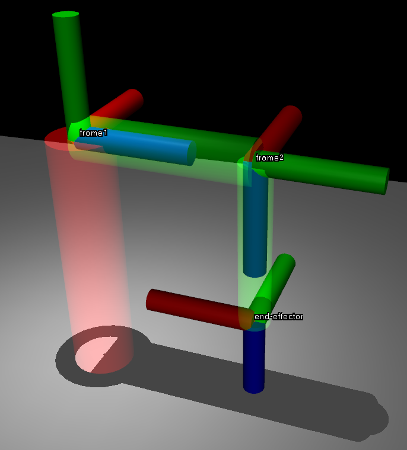

# ME 467 Project 1

Caleb Hottes

Charles Friley

OUTLINE
1. Introduction
	Overview of the Furuta pendulum
	Importance of kinematics in robotics
	Goals of the project
	Tools used (MuJoCo, mathematical methods)
2. Position-Level Kinematics (Question 1)
	Introduction
	Methodology
	Results
	Discussion
3. Velocity-Level Kinematics (Question 2)
	Introduction
	Methodology
	Results
	Discussion
4. Verification in MuJoCo (Question 3)
	Introduction
	Implementation details
	Validation of results
	Discussion
5. Simulation and Analysis (Question 4)
	Introduction
	Simulation setup (Runge-Kutta integration, applied torque)
	Results (height of end-effector, linear & angular velocity plots)
	System behavior analysis
6. Conclusion
	Summary of key findings
	Alignment with theoretical expectations
	Lessons learned and future improvements
 
## Position-Level Kinematics (Question 1)

### Introduction

In this section we will resolve the position-level forward and inverse kinematics of the Furuta pendulum with the help of the coordinate systems as shown in the figure. 

Parts a, b, and c of question 1 will be shown simultaneously and parts d and e will be shown seperatly after. 

### Methodology and Results

#### Parts A, B, and C

To start, we will first find the the position level kinematics of frame c and frame 2 in respect to frame 0 (${}^0T_c$ and  ${}^0T_2$). To do this we first construct all the rotation and position matrixes from frame 0 to frame c by inspection. 

The positions can be constructed by inspection. 

$${}^0t_1 = \left[\begin{matrix}0\\0\\d_{1}\end{matrix}\right], {}^1t_2 = \left[\begin{matrix}0\\0\\d_{2}\end{matrix}\right], {}^2t_c = \left[\begin{matrix}0\\0\\d_{3}\end{matrix}\right]$$

The rotations are simple to construct.

From 0 to 1, we first rotate about $x$ by $\pi/2$, then we rotate about $y$ by $\theta_{1}$.

$$R_{x, \pi/2} R_{y, \theta_{1}} = {}^0R_1 = \left[\begin{matrix}\cos{\left(\theta_{1} \right)} & 0 & \sin{\left(\theta_{1} \right)}\\\sin{\left(\theta_{1} \right)} & 0 & - \cos{\left(\theta_{1} \right)}\\0 & 1 & 0\end{matrix}\right]$$

From 1 to 2, we first rotate about $x$ by $\pi/2$, then we rotate about $y$ by $\theta_{2}$.

$$R_{x, \pi/2} R_{y, \theta_{2}} = {}^1R_2 = \left[\begin{matrix}\cos{\left(\theta_{2} \right)} & 0 & \sin{\left(\theta_{2} \right)}\\\sin{\left(\theta_{2} \right)} & 0 & - \cos{\left(\theta_{2} \right)}\\0 & 1 & 0\end{matrix}\right]$$

From 2 to c, we just rotate about $z$ by $-\pi/2$.

$$R_{z, -\pi/2} = {}^2R_c = \left[\begin{matrix}0 & 1 & 0\\-1 & 0 & 0\\0 & 0 & 1\end{matrix}\right]$$

From these, the homogenous representation of the pose can be constructed.

$$ {}^0T_1 = \left[\begin{matrix}\cos{\left(\theta_{1} \right)} & 0 & \sin{\left(\theta_{1} \right)} & 0\\\sin{\left(\theta_{1} \right)} & 0 & - \cos{\left(\theta_{1} \right)} & 0\\0 & 1 & 0 & d_{1}\\0 & 0 & 0 & 1\end{matrix}\right]$$

$$ {}^1T_2 = \left[\begin{matrix}\cos{\left(\theta_{2} \right)} & 0 & \sin{\left(\theta_{2} \right)} & 0\\\sin{\left(\theta_{2} \right)} & 0 & - \cos{\left(\theta_{2} \right)} & 0\\0 & 1 & 0 & d_{2}\\0 & 0 & 0 & 1\end{matrix}\right]$$

$$ {}^2T_c = \left[\begin{matrix}0 & 1 & 0 & 0\\-1 & 0 & 0 & 0\\0 & 0 & 1 & d_{3}\\0 & 0 & 0 & 1\end{matrix}\right]$$

With these poses the desired pose can be constructed.

$$^{0}T_{c} = {}^{0}T_{1} \, {}^{1}T_{2} \, {}^{2}T_{c}$$

$$^{0}T_{2} = {}^{0}T_{1} \, {}^{1}T_{2} $$

Which results in:

$$^{0}T_{c} = \left[\begin{matrix}- \sin{\left(\theta_{1} \right)} & \cos{\left(\theta_{1} \right)} \cos{\left(\theta_{2} \right)} & \sin{\left(\theta_{2} \right)} \cos{\left(\theta_{1} \right)} & d_{2} \sin{\left(\theta_{1} \right)} + d_{3} \sin{\left(\theta_{2} \right)} \cos{\left(\theta_{1} \right)}\\\cos{\left(\theta_{1} \right)} & \sin{\left(\theta_{1} \right)} \cos{\left(\theta_{2} \right)} & \sin{\left(\theta_{1} \right)} \sin{\left(\theta_{2} \right)} & - d_{2} \cos{\left(\theta_{1} \right)} + d_{3} \sin{\left(\theta_{1} \right)} \sin{\left(\theta_{2} \right)}\\0 & \sin{\left(\theta_{2} \right)} & - \cos{\left(\theta_{2} \right)} & d_{1} - d_{3} \cos{\left(\theta_{2} \right)}\\0 & 0 & 0 & 1\end{matrix}\right]$$

$$ ^{0}T_{2} = \left[\begin{matrix}\cos{\left(\theta_{1} \right)} \cos{\left(\theta_{2} \right)} & \sin{\left(\theta_{1} \right)} & \sin{\left(\theta_{2} \right)} \cos{\left(\theta_{1} \right)} & d_{2} \sin{\left(\theta_{1} \right)}\\\sin{\left(\theta_{1} \right)} \cos{\left(\theta_{2} \right)} & - \cos{\left(\theta_{1} \right)} & \sin{\left(\theta_{1} \right)} \sin{\left(\theta_{2} \right)} & - d_{2} \cos{\left(\theta_{1} \right)}\\\sin{\left(\theta_{2} \right)} & 0 & - \cos{\left(\theta_{2} \right)} & d_{1}\\0 & 0 & 0 & 1\end{matrix}\right] $$

Plugging in the values of $\theta$ from part a of question 1,  $\theta_1 = \pi/3$ and $\theta_2=-3\pi/7$  we find that:

$$ ^{0}T_{c} = \left[\begin{matrix}-0.5 & -0.193 & 0.844 & 1.075\\-0.866 & 0.111 & -0.487 & 0.303\\0.0 & -0.975 & -0.223 & 1.022\\0.0 & 0.0 & 0.0 & 1.0\end{matrix}\right] $$

$$ ^{0}T_{2} = \left[\begin{matrix}-0.193 & 0.5 & 0.844 & 0.4\\0.111 & 0.866 & -0.487 & 0.693\\-0.975 & 0.0 & -0.223 & 1.2\\0.0 & 0.0 & 0.0 & 1.0\end{matrix}\right] $$

The rotation matrix can be extracted:

$$ ^{0}R_{c} = \left[\begin{matrix}-0.5 & -0.193 & 0.844\\-0.866 & 0.111 & -0.487\\0.0 & -0.975 & -0.223\end{matrix}\right] $$

$$ ^{0}R_{2} = \left[\begin{matrix}-0.193 & 0.5 & 0.844\\0.111 & 0.866 & -0.487\\-0.975 & 0.0 & -0.223\end{matrix}\right] $$

Which can then be represented both as a unit quaternion and as a axis-angle. We used the `r2q()` function for the quaternion representation and `tr2angvec()` function for the axis angle representation, both from Spatial Math.

The quaternion representing $^{0}R_{c}$ is: 

$$\ 0.3117 < -0.3909,  0.6771, -0.5400 > $$

The quaternion representing $^{0}R_{2}$ is: 
$$  0.6022 <  0.2024,  0.7552, -0.1614 > $$

The axis angle representing $^{0}R_{c}$ is:

$$ Angle: 2.508 \ rad \\ Axis: \left[\begin{matrix}-0.411 & 0.713 &  -0.568\end{matrix}\right]$$

The axis angle representing $^{0}R_{2}$ is:
$$ Angle: 1.849 \ rad \\ Axis: \left[\begin{matrix}0.253 & 0.946 & -0.202\end{matrix}\right]
$$

The rotation matrix can be recovered from the axis-angle representation by using rodrigues formula.

$ R = e^{\widehat{\omega} \theta} = \mathbf{I} + \sin(\theta) \widehat{\omega} + (1 - \cos(\theta)) \widehat{\omega}^2 $

Where:
- $\omega$ is the **axis of rotation**, a unit vector that defines the direction of rotation.
- $\theta$ is the **scalar part of the axis-angle rotation**, representing the rotation magnitude in radians.
- $\widehat{\omega}$ is the **skew-symmetric matrix** of $\omega$, used to compute the rotation matrix.
- $\mathbf{I}$ is the **identity matrix**.

Implementing this formula allowed us to recover the rotation matrix. 

$$ ^{0}R_{c} = \left[\begin{matrix}-0.5 & -0.193 & 0.844\\-0.866 & 0.111 & -0.487\\0.0 & -0.975 & -0.223\end{matrix}\right] $$

$$ ^{0}R_{2} = \left[\begin{matrix}-0.193 & 0.5 & 0.844\\0.111 & 0.866 & -0.487\\-0.975 & 0.0 & -0.223\end{matrix}\right] $$

#### Part D
If camera is installed at the end-effector of the Furuta pendulum, what is the value of $ \theta_1 $ and $ \theta_2 $ if the $ z $-axis of the camera points in the direction $ k $, where

$$
k = -\frac{1}{2} x_0 + \frac{1}{2} y_0 - \frac{\sqrt{2}}{2} z_0.
$$

In order to solve this question, we need to find the solutions for $\theta_1$ and $\theta_2$ in this equation:

$$
\begin{bmatrix} 
\ {}^0z_{c,1} \\ 
\ {}^0z_{c,2} \\ 
\ {}^0z_{c,3} 
\end{bmatrix} 
=
\begin{bmatrix} 
k_1 \\ 
k_2 \\ 
k_3 
\end{bmatrix}
$$
Where $^0z_c$ is the $z$ part of  $^{0}R_{c}$. Plugging in values:
$$
\begin{bmatrix} 
\sin{\left(\theta_{2} \right)} \cos{\left(\theta_{1} \right)} \\ 
\sin{\left(\theta_{1} \right)} \sin{\left(\theta_{2} \right)} \\ 
- \cos{\left(\theta_{2} \right)} 
\end{bmatrix} 
=
\begin{bmatrix} 
-0.5 \\ 
0.5 \\ 
- \frac{\sqrt{2}}{2} 
\end{bmatrix}
$$

We plugged these formulas into the `solve()` function in SymPy. This produced four potential solutions, which we then checked by plugging those $\theta$ values back into the forward kinematic equations to see if the resulting orientation matches that of the desired orientation. Only two of the four solution pairs were correct:

$$
\begin{align*}
(\theta_1, \theta_2) &= (-0.785, 5.498),\\
                     &\quad \ (2.356, 0.785)
\end{align*}
$$

Two solutions should be expected, since the end effector can reach the same z-axis orientation from two separate positions. 

#### Part E

In this question we are asked to find the value of $ \theta_1 $ and $ \theta_2 $ if the position of the camera is located at $p = 1.075x_0 + 0.303y_0 + 1.022z_0$ in respect to the world frame. Solving this is similar to the solution path layed out in part d. First, we will find the inverse kinematic equations for position, then plug in our position to solve.

The desired position is given by:

$ p={}^0t_c = [{}^0x_c, {}^0y_c, {}^0z_c] $

Which can be extracted from the pose ${}^0T_c$. Each part is a function of $\theta_1$ and $\theta_2$:

$ {}^0x_c = f(\theta_1, \theta_2) $

$ {}^0y_c = f(\theta_1, \theta_2) $

$ {}^0z_c = f(\theta_1, \theta_2) $

From these three equations, $ \theta_1 $ and $ \theta_2 $ can be solved to achieve the desired position.

Plugging in these equations into the SymPy `solve()` function yielded four solutions, which are lengthy. **Only two of these solutions will be valid, but we will not find out which until we plug in the numbers after.** 

---
Potential Solution 1:

$ \theta_1 = - 2 \operatorname{atan}{\left(\frac{d_{3} \sqrt{\frac{\left(- d_{1} + d_{3} + {}^0z_c\right) \left(d_{1} + d_{3} - {}^0z_c\right)}{d_{3}^{2}}} - \sqrt{- d_{1}^{2} + 2 d_{1} {}^0z_c + d_{2}^{2} + d_{3}^{2} - \left({}^0y_c\right)^{2} - \left({}^0z_c\right)^{2}}}{d_{2} - {}^0y_c} \right)} $

$ \theta_2 = \operatorname{acos}{\left(\frac{d_{1} - {}^0z_c}{d_{3}} \right)} $
___

Potential Solution 2:

$ \theta_1 = 2 \operatorname{atan}{\left(\frac{d_{3} \sqrt{\frac{\left(- d_{1} + d_{3} + {}^0z_c\right) \left(d_{1} + d_{3} - {}^0z_c\right)}{d_{3}^{2}}} - \sqrt{- d_{1}^{2} + 2 d_{1} {}^0z_c + d_{2}^{2} + d_{3}^{2} - \left({}^0y_c\right)^{2} - \left({}^0z_c\right)^{2}}}{d_{2} - {}^0y_c} \right)} $

$ \theta_2 = - \operatorname{acos}{\left(\frac{d_{1} - {}^0z_c}{d_{3}} \right)} + 2 \pi $
___

Potential Solution 3:

$ \theta_1 = - 2 \operatorname{atan}{\left(\frac{d_{3} \sqrt{\frac{\left(- d_{1} + d_{3} + {}^0z_c\right) \left(d_{1} + d_{3} - {}^0z_c\right)}{d_{3}^{2}}} + \sqrt{- d_{1}^{2} + 2 d_{1} {}^0z_c + d_{2}^{2} + d_{3}^{2} - \left({}^0y_c\right)^{2} - \left({}^0z_c\right)^{2}}}{d_{2} - {}^0y_c} \right)} $

$ \theta_2 = \operatorname{acos}{\left(\frac{d_{1} - {}^0z_c}{d_{3}} \right)} $
___

Potential Solution 4:

$ \theta_1 = 2 \operatorname{atan}{\left(\frac{d_{3} \sqrt{\frac{\left(- d_{1} + d_{3} + {}^0z_c\right) \left(d_{1} + d_{3} - {}^0z_c\right)}{d_{3}^{2}}} + \sqrt{- d_{1}^{2} + 2 d_{1} {}^0z_c + d_{2}^{2} + d_{3}^{2} - \left({}^0y_c\right)^{2} - \left({}^0z_c\right)^{2}}}{d_{2} - {}^0y_c} \right)} $

$ \theta_2 = - \operatorname{acos}{\left(\frac{d_{1} - {}^0z_c}{d_{3}} \right)} + 2 \pi $

---

Plugging in our values from $p$ results in 4 soulution pairs, which were then checked by plugging in the resulting theta values back into the forward kinematic equations and checking to see if the positions matched up. Only two of the solutions brought correct solutions for theta, which are:

$$
\begin{align*}
(\theta_1, \theta_2) &= (1.073, 1.346),\\
                     &\quad \ (2.618, -1.346) 
\end{align*}
$$

Two solutions should be expected, since the end effector can reach the same position from two separate orientations. 

## Velocity-Level Kinematics (Question 2)

### Introduction

In this section we will be solving the forward and inverse velocity level kinematics of the Furuta Pendulum.  

### Methodology and Results

We started as recommended by resolving the forward and inverse kinematics.  

---

#### Forward Velocity Kinematics
The first step was to compute the spatial twist. In order to find the spatial twist we need to know the angular velocity $\mathsf{\omega}$ and the velocity *v* of the end-effector with respect to the world frame. We will fist consider the spatial case. 

##### Spatial Case
The spatial twist of frame c with respect to the world frame is given by ${}^0\hat{V}_c^0=\dot{T}T^{-1}$ From question 1 we have ${}^0T_c^0$ and can invert it, so all we need to find is $\dot{T}$.

We know that $\dot{T} = \begin{bmatrix}\dot{R} & \dot{t} \\\bold{0} & 0\end{bmatrix}$ so we need to find $\dot{R}$ and $\dot{t}$.

From the definition we know that ${}^0\dot{R}_c={}^0\hat{\omega}_c^0 * {}^0R_c$. We have already found ${}^0R_c$ in question one, which means all we need to do now is cobble together the angular velocity of the end-effector as shown:

$${}^0\omega_c^0={}^0\omega_1^0 + {}^0R_1{}^1\omega_2^1 + {}^0R_1{}^1R_2{}^2\omega_c^2$$

By inspection of the problem's diagram we see that ${}^0\omega_1^0$ and ${}^1\omega_2^1$ are both easily determined beucase they lie along a single axis all the time. Furthermore ${}^2\omega_c^2$  is even easier becuase it is just **0**.
$${}^0\omega_1^0=\begin{bmatrix}0 & 0 & \dot\theta_1\end{bmatrix}^{T}$$ 
$${}^1\omega_2^1=\begin{bmatrix}0 & 0 & \dot\theta_2\end{bmatrix}^{T}$$
$${}^2\omega_c^2=\begin{bmatrix}0 & 0 & 0 \end{bmatrix}^{T}$$

Because we know the rotation matrices from question 1, we could now work backwards and produce an expression for $\dot{R}$ in terms of $\theta_1$ and $\theta_2$. 
Now we turn our attention to finding $\dot{t_c^0}$. 

From question 1 we have that:
$$t_c^{0}=\left[\begin{matrix}d_{2} \sin{\left(\theta_{1} \right)} + d_{3} \sin{\left(\theta_{2} \right)} \cos{\left(\theta_{1} \right)}\\- d_{2} \cos{\left(\theta_{1} \right)} + d_{3} \sin{\left(\theta_{1} \right)} \sin{\left(\theta_{2} \right)}\\d_{1} - d_{3} \cos{\left(\theta_{2} \right)}\end{matrix}\right]$$

Taking the time derivative we find:
$$\dot{t_c^0}=\left[\begin{matrix}\dot{\theta_1} d_{2} \cos{\left(\theta_{1} \right)} - \dot{\theta_1} d_{3} \sin{\left(\theta_{1} \right)} \sin{\left(\theta_{2} \right)} + \dot{\theta_2} d_{3} \cos{\left(\theta_{1} \right)} \cos{\left(\theta_{2} \right)}\\\dot{\theta_1} d_{2} \sin{\left(\theta_{1} \right)} + \dot{\theta_1} d_{3} \sin{\left(\theta_{2} \right)} \cos{\left(\theta_{1} \right)} + \dot{\theta_2} d_{3} \sin{\left(\theta_{1} \right)} \cos{\left(\theta_{2} \right)}\\\dot{\theta_2} d_{3} \sin{\left(\theta_{2} \right)}\end{matrix}\right]$$

Now we have all the pieces we need:${}^0\hat{V}_c^0=\dot{T}T^{-1}$ Where  $\dot{T} = \begin{bmatrix}\dot{R} & \dot{t} \\\bold{0} & 0\end{bmatrix}$ and from question 1 we have: 
$$T=\left[\begin{matrix}- \sin{\left(\theta_{1} \right)} & \cos{\left(\theta_{1} \right)} \cos{\left(\theta_{2} \right)} & \sin{\left(\theta_{2} \right)} \cos{\left(\theta_{1} \right)} & d_{2} \sin{\left(\theta_{1} \right)} + d_{3} \sin{\left(\theta_{2} \right)} \cos{\left(\theta_{1} \right)}\\\cos{\left(\theta_{1} \right)} & \sin{\left(\theta_{1} \right)} \cos{\left(\theta_{2} \right)} & \sin{\left(\theta_{1} \right)} \sin{\left(\theta_{2} \right)} & - d_{2} \cos{\left(\theta_{1} \right)} + d_{3} \sin{\left(\theta_{1} \right)} \sin{\left(\theta_{2} \right)}\\0 & \sin{\left(\theta_{2} \right)} & - \cos{\left(\theta_{2} \right)} & d_{1} - d_{3} \cos{\left(\theta_{2} \right)}\\0 & 0 & 0 & 1\end{matrix}\right]$$

Using sympy we can invert $T$ and perform the manipulations ending with the spatial twist being:
$${}^0\hat{V}_c^0=\left[\begin{matrix}\dot{\theta_2} d_{1} \cos{\left(\theta_{1} \right)}\\\dot{\theta_2} d_{1} \sin{\left(\theta_{1} \right)}\\0\\\dot{\theta_2} \sin{\left(\theta_{1} \right)}\\- \dot{\theta_2} \cos{\left(\theta_{1} \right)}\\\dot{\theta_1}\end{matrix}\right]$$

##### Body Case

Now the goal is to do the same calculation but in the body frame. 

For the body twist ${}^c\hat{V}_c^0=T^{-1}\dot{T}$ Where  $\dot{T} = \begin{bmatrix}\dot{R} & \dot{t} \\\bold{0} & 0\end{bmatrix}$.  We can find $\dot{R}$ in much the same way however we will need to use body angular velocities and the formula ${}^0\dot{R}_c={}^0R_c {}^c\hat{\omega}_c^0$
$${}^c\omega_c^0={}^c\omega_1^0 + {}^c\omega_2^1 + {}^c\omega_c^2$$
$${}^c\omega_c^0=({}^0R_c)^{T} * {}^0\omega_1^0 + ({}^2R_c)^{T} * ({}^1R_2)^{T} * {}^1\omega_2^1 + ({}^2R_c)^{T} * {}^2\omega_c^2$$

Now $\dot{t}$ is the same for both spatial and body twists so we can now construct $\dot{T}$ using our newly found $\dot{R}$ and from there we can follow the same process as spatial, inverting $T$ but this time $T^{-1}$ is multiplied on the right of $\dot{T}$ to create the body twist. Using sympy we find that:
$${}^c\hat{V}_c^0=\left[\begin{matrix}\dot{\theta_1} d_{3} \sin{\left(\theta_{2} \right)}\\\dot{\theta_1} d_{2} \cos{\left(\theta_{2} \right)} + \dot{\theta_2} d_{3}\\\dot{\theta_1} d_{2} \sin{\left(\theta_{2} \right)}\\- \dot{\theta_2}\\\dot{\theta_1} \sin{\left(\theta_{2} \right)}\\- \dot{\theta_1} \cos{\left(\theta_{2} \right)}\end{matrix}\right]$$

Now as a quick gut check we can use an adjoint transformation to recompute the body twist from the spatial twist and verify that they are the same. The adjoint transformation is defined as: $Ad_\bold{T}=\begin{bmatrix}R & \hat{t}R \\ 0 & R \end{bmatrix}$ Constructing an adjoint matrix with ${{}^0T_c}^{-1}$ and applying it to ${}^c\hat{V}_c^0$ we obtain that the spatial twist is  $$\left[\begin{matrix}\dot{\theta_1} d_{3} \sin{\left(\theta_{2} \right)}\\\dot{\theta_1} d_{2} \cos{\left(\theta_{2} \right)} + \dot{\theta_2} d_{3}\\\dot{\theta_1} d_{2} \sin{\left(\theta_{2} \right)}\\- \dot{\theta_2}\\\dot{\theta_1} \sin{\left(\theta_{2} \right)}\\- \dot{\theta_1} \cos{\left(\theta_{2} \right)}\end{matrix}\right]$$

This matches what we found earlier, which is a good sign. 

#### Inverse Velocity Kinematics

In this section, we will be solving for $\dot{\theta}_1$ and $\dot{\theta}_2$, the joint velocities of the Furuta pendulum, given a desired end-effector twist. We will solve for the spatial and body. 

##### Spatial Case

For the spatial case we must solve the following equation for $ \dot{\theta}_1 $ and $ \dot{\theta}_2 $:
$${}^0V_c^0 = \begin{bmatrix} \dot{\theta_2} d_{1} \cos{\left(\theta_{1} \right)} \\ \dot{\theta_2} d_{1} \sin{\left(\theta_{1} \right)} \\ 0 \\ \dot{\theta_2} \sin{\left(\theta_{1} \right)} \\ - \dot{\theta_2} \cos{\left(\theta_{1} \right)} \\ \dot{\theta_1} \end{bmatrix} = \begin{bmatrix} {}^0_xv_c^0 \\ {}^0_yv_c^0 \\ {}^0_zv_c^0 \\ {}^0_xw_c^0 \\ {}^0_yw_c^0 \\ {}^0_zw_c^0 \end{bmatrix}$$ 

This equation looks over determined, but upon solving it we will find that the solutions are related and when numbers are added, they all yield the same answer. 

*Note that ${}^0_xv_c^0$ represents the x part of the linear velocity of frame c in respect to frame 0 represented in frame 0 and ${}^0_xw_c^0$ represents the same thing for angular velocity.*

From the symbolic solution, we find:

- The joint velocity $ \dot{\theta}_1 $ is uniquely determined by the spatial twist’s $ z $-angular component:

$$
\dot{\theta}_1 = {}^0_z \omega_c^0.
$$

- The joint velocity $ \dot{\theta}_2 $ can take multiple equivalent forms:

$$
\dot{\theta}_2 = 
\begin{cases}
    \displaystyle \frac{{}^0_x v_c^0}{d_1 \cos(\theta_1)}, & \text{(from equation 1)} \\[8pt]
    \displaystyle \frac{{}^0_y v_c^0}{d_1 \sin(\theta_1)}, & \text{(from equation 2)} \\[8pt]
    \displaystyle \frac{{}^0_x \omega_c^0}{\sin(\theta_1)}, & \text{(from equation 4)} \\[8pt]
    \displaystyle -\,\frac{{}^0_y \omega_c^0}{\cos(\theta_1)}. & \text{(from equation 5)}
\end{cases}
$$

In summary, $\dot{\theta}_1$  is directly determined by the  $z$ -angular component of the spatial twist, whereas  $\dot{\theta}_2$  has multiple possible expressions depending on different parts of the spatial twist.

##### Body Case
 
For the body case, we use the body twist in our equation. Solve for $ \dot{\theta}_1 $ and $ \dot{\theta}_2 $:
$$
{}^cV_c^0
=
\left[
\begin{array}{c}
\dot{\theta_1} d_{3} \sin{\left(\theta_{2} \right)} \\
\dot{\theta_1} d_{2} \cos{\left(\theta_{2} \right)} + \dot{\theta_2} d_{3} \\
\dot{\theta_1} d_{2} \sin{\left(\theta_{2} \right)} \\
- \dot{\theta_2} \\
\dot{\theta_1} \sin{\left(\theta_{2} \right)} \\
- \dot{\theta_1} \cos{\left(\theta_{2} \right)}
\end{array}
\right]
=
\left[
\begin{array}{c}
{}^c_xv_c^0 \\
{}^c_yv_c^0 \\
{}^c_zv_c^0 \\
{}^c_xw_c^0 \\
{}^c_yw_c^0 \\
{}^c_zw_c^0
\end{array}
\right]
$$

From the symbolic solution, we find:

- The joint velocity $ \dot{\theta}_2 $ is uniquely determined by the body twist’s $ x $-angular component:

$$
\dot{\theta}_2 = -{}^c_x \omega_c^0  \text{(from equation 4)}
$$

- The joint velocity $ \dot{\theta}_1 $ can take multiple equivalent forms:

$$
\dot{\theta}_1 = 
\begin{cases}
    \displaystyle \frac{{}^c_x v_c^0}{d_3 \sin(\theta_2)}, & \text{(from equation 1)} \\[8pt]
    \displaystyle \frac{{}^c_z v_c^0}{d_2 \sin(\theta_2)}, & \text{(from equation 3)} \\[8pt]
    \displaystyle \frac{{}^c_y \omega_c^0}{\sin(\theta_2)}, & \text{(from equation 5)} \\[8pt]
    \displaystyle -\,\frac{{}^c_z \omega_c^0}{\cos(\theta_2)}, & \text{(from equation 6)} \\[8pt]
    \displaystyle \frac{d_3 {}^c_x \omega_c^0 + {}^c_y v_c^0}{d_2 \cos(\theta_2)}. & \text{(from equation 2, after substituting $ \dot{\theta}_2 $)}
\end{cases}
$$

In summary, $ \dot{\theta}_2 $ is directly determined by the body twist’s $ x $-angular component, whereas $ \dot{\theta}_1 $ has multiple possible expressions.

---
#### Question 2 part A

We are given that the joint velocities are:

$$
\dot{\boldsymbol{\theta}} = \begin{bmatrix} 1 & 2 \end{bmatrix}^{\top}
$$ 

To find the body and spatial twists (angular and linear velocity) of the end-effector we can just plug these values into the expressions we found earlier:

##### Spatial

$${}^0V_c^0=\left[\begin{matrix}\dot{\theta_2} d_{1} \cos{\left(\theta_{1} \right)}\\\dot{\theta_2} d_{1} \sin{\left(\theta_{1} \right)}\\0\\\dot{\theta_2} \sin{\left(\theta_{1} \right)}\\- \dot{\theta_2} \cos{\left(\theta_{1} \right)}\\\dot{\theta_1}\end{matrix}\right] \Rightarrow \left[\begin{matrix}-2.078\\1.2\\0.0\\1.0\\1.732\\1.0\end{matrix}\right]$$

##### Body

$${}^cV_c^0=\left[\begin{matrix}\dot{\theta_1} d_{3} \sin{\left(\theta_{2} \right)}\\\dot{\theta_1} d_{2} \cos{\left(\theta_{2} \right)} + \dot{\theta_2} d_{3}\\\dot{\theta_1} d_{2} \sin{\left(\theta_{2} \right)}\\- \dot{\theta_2}\\\dot{\theta_1} \sin{\left(\theta_{2} \right)}\\- \dot{\theta_1} \cos{\left(\theta_{2} \right)}\end{matrix}\right] \Rightarrow \left[\begin{matrix}-0.780\\1.778\\-0.780\\-2.0\\-0.975\\-0.223\end{matrix}\right]$$

---
#### Question 2 part B

Now we need to find both the body and spatial twists of frame 2 at the same pose as part a. We are performing the same calculation as was done to find the twists of the end-effector, but nevertheless, the calculations will be shown. 

The spatial twist of frame 2 with respect to the world frame is given by ${}^0\hat{V}_2^0=\dot{T}T^{-1}$ 

From question 1 we have ${T}_2^0$ and can invert it, so all we need to find is $\dot{T}$.

We know that $\dot{T} = \begin{bmatrix}\dot{R} & \dot{t} \\\bold{0} & 0\end{bmatrix}$ so we need to find $\dot{R}$ and $\dot{t}$.

From the definition we know that ${}^0\dot{R}_2={}^0\hat{\omega}_2^0 * {}^0R_2$. We have already found ${}^0R_2$ in question one, which means all we need to do now is cobble together the angular velocity  of frame 2 from elements we have already found as shown:

$${}^0\omega_2^0={}^0\omega_1^0 + {}^0\omega_2^1$$

Now we turn our attention to finding $\dot{t_2^0}$. 

From question 1 we have that:
$$t_2^{0}=\left[\begin{matrix}d_{2} \sin{\left(\theta_{1} \right)}\\- d_{2} \cos{\left(\theta_{1} \right)}\\d_{1}\end{matrix}\right]$$

Taking the time derivative we find:
$$\dot{t_2^0}=\left[\begin{matrix}\dot{\theta_1} d_{2} \cos{\left(\theta_{1} \right)}\\\dot{\theta_1} d_{2} \sin{\left(\theta_{1} \right)}\\0\end{matrix}\right]$$

Now we have all the pieces we need: ${}^0\hat{V}_2^0=\dot{T}T^{-1}$ Where  $\dot{T} = \begin{bmatrix}\dot{R} & \dot{t} \\\bold{0} & 0\end{bmatrix}$ and from question 1 we have: 
$$T=\left[\begin{matrix}\cos{\left(\theta_{1} \right)} \cos{\left(\theta_{2} \right)} & \sin{\left(\theta_{1} \right)} & \sin{\left(\theta_{2} \right)} \cos{\left(\theta_{1} \right)} & d_{2} \sin{\left(\theta_{1} \right)}\\\sin{\left(\theta_{1} \right)} \cos{\left(\theta_{2} \right)} & - \cos{\left(\theta_{1} \right)} & \sin{\left(\theta_{1} \right)} \sin{\left(\theta_{2} \right)} & - d_{2} \cos{\left(\theta_{1} \right)}\\\sin{\left(\theta_{2} \right)} & 0 & - \cos{\left(\theta_{2} \right)} & d_{1}\\0 & 0 & 0 & 1\end{matrix}\right]
$$

Using sympy we can invert $T$ and perform the manipulations ending with the spatial twist being:
$$\left[\begin{matrix}\dot{\theta_2} d_{1} \cos{\left(\theta_{1} \right)}\\\dot{\theta_2} d_{1} \sin{\left(\theta_{1} \right)}\\0\\\dot{\theta_2} \sin{\left(\theta_{1} \right)}\\- \dot{\theta_2} \cos{\left(\theta_{1} \right)}\\\dot{\theta_1}\end{matrix}\right]$$

#### Body twist

Now the goal is to do the same calculation but in the body frame. 

For the body twist ${}^2\hat{V}_2^0=T^{-1}\dot{T}$ Where  $\dot{T} = \begin{bmatrix}\dot{R} & \dot{t} \\\bold{0} & 0\end{bmatrix}$.  We can find $\dot{R}$ in much the same way however we will need to use body angular velocities and the formula ${}^0\dot{R}_2={}^0R_2 {}^2\hat{\omega}_2^0$

$${}^2\omega_2^0={}^2\omega_1^0 + {}^2\omega_2^1$$
$${}^2\omega_2^0=({}^0R_2)^{T} * {}^0\omega_1^0 + ({}^1R_2)^{T} * {}^1\omega_2^1$$

Now $\dot{t}$ is the same for both spatial and body twists so we can now construct $\dot{T}$ using our newly found $\dot{R}$ and from there we can follow the same process as spatial, inverting $T$ but this time $T^{-1}$ is multiplied on the right of $\dot{T}$ to create the body twist. Using sympy we find that:
$${}^2\hat{V}_2^0=\left[\begin{matrix}\dot{\theta_1} d_{2} \cos{\left(\theta_{2} \right)}\\0\\\dot{\theta_1} d_{2} \sin{\left(\theta_{2} \right)}\\\dot{\theta_1} \sin{\left(\theta_{2} \right)}\\\dot{\theta_2}\\- \dot{\theta_1} \cos{\left(\theta_{2} \right)}\end{matrix}\right]$$

Now as a quick gut check we can use an adjoint transformation to recompute the body twist from the spatial twist and verify that they are the same. The adjoint transformation is defined as: $Ad_\bold{T}=\begin{bmatrix}R & \hat{t}R \\ 0 & R \end{bmatrix}$ Constructing an adjoint matrix with ${{}^0T_2}^{-1}$ and applying it to ${}^2\hat{V}_2^0$ we obtain that the spatial twist is  $$\left[\begin{matrix}\dot{\theta_1} d_{2} \cos{\left(\theta_{2} \right)}\\0\\\dot{\theta_1} d_{2} \sin{\left(\theta_{2} \right)}\\\dot{\theta_1} \sin{\left(\theta_{2} \right)}\\\dot{\theta_2}\\- \dot{\theta_1} \cos{\left(\theta_{2} \right)}\end{matrix}\right]$$

This matches what we found earlier, which is a good sign. 

##### Substituting Values

Now finally we can solve this part by substituting the given values into the expressions we just derived:

##### Spatial

$${}^0V_2^0=\left[\begin{matrix}\dot{\theta_2} d_{1} \cos{\left(\theta_{1} \right)}\\\dot{\theta_2} d_{1} \sin{\left(\theta_{1} \right)}\\0\\\dot{\theta_2} \sin{\left(\theta_{1} \right)}\\- \dot{\theta_2} \cos{\left(\theta_{1} \right)}\\\dot{\theta_1}\end{matrix}\right] \Rightarrow \left[\begin{matrix}-2.078\\1.2\\0.0\\1.0\\1.732\\1.0\end{matrix}\right]$$

##### Body

$${}^2V_2^0={}^2\hat{V}_2^0=\left[\begin{matrix}\dot{\theta_1} d_{2} \cos{\left(\theta_{2} \right)}\\0\\\dot{\theta_1} d_{2} \sin{\left(\theta_{2} \right)}\\\dot{\theta_1} \sin{\left(\theta_{2} \right)}\\\dot{\theta_2}\\- \dot{\theta_1} \cos{\left(\theta_{2} \right)}\end{matrix}\right] \Rightarrow \left[\begin{matrix}0.178\\0.0\\-0.78\\-0.975\\2.0\\-0.223\end{matrix}\right]$$

---
#### Question 2 part C

Now are are asked so find the joint rates of the end-effector frame at the same pose in part A  if $\{C\} $ is moving with a body twist given by:

$$
{}^cV_c^0 = (\mathbf{v}_c, \boldsymbol{\omega}_c) = 
\begin{bmatrix} 0.39 & 0.871 & 0.39 & -1.2 & 0.487 & 0.111 \end{bmatrix}^{\top}
$$

*Note that v and ${\omega}$ have been swapped from the instructions in order to fit our notation*

From earlier we know:

$$
\dot{\theta}_2 = -{}^c_x \omega_c^0 
$$

$$
\dot{\theta}_1 = 
\begin{cases}
    \displaystyle \frac{{}^c_x v_c^0}{d_3 \sin(\theta_2)}, & \\[8pt]
    \displaystyle \frac{{}^c_z v_c^0}{d_2 \sin(\theta_2)}, & \\[8pt]
    \displaystyle \frac{{}^c_y \omega_c^0}{\sin(\theta_2)}, & \\[8pt]
    \displaystyle -\,\frac{{}^c_z \omega_c^0}{\cos(\theta_2)}, & \\[8pt]
    \displaystyle \frac{d_3 {}^c_x \omega_c^0 + {}^c_y v_c^0}{d_2 \cos(\theta_2)}. & \end{cases}
$$

Substituting in the given values to the first equation yields that $\dot\theta_2=1.2$ (rad/s). 

For $\dot\theta_1$ substituting values into all 5 equations yields the same value: -0.5 (rad/s)

Thus 
$$\dot{\theta}_1 = -0.5 \text{ rad/s}, \quad \dot{\theta}_2 = 1.2 \text{ rad/s}$$
---

#### Question 2 Part D

We are asked to repeat part C for the spatial case with the given values:

$$
{}^0V_c^0 = (\mathbf{v}_c, \boldsymbol{\omega}_c) = 
\begin{bmatrix} -1.247 & 0.72 & 0 & 0.6 & 1.039 & -0.5 \end{bmatrix}^{\top}
$$
*Note that v and ${\omega}$ have been swapped from the instructions in order to fit our notation*

Substituting in values like we did in part C yields:
$$
\dot{\theta}_1 = -0.5 \text{ rad/s}, \quad \dot{\theta}_2 = 1.2 \text{ rad/s}
$$

#### Conclusion
The spatial and body angular rates are the same, which is expected and serves to justify the answer. 

## Simulation Verification of Kinematic Equations (Question 3)

### Introduction

In this section we will be showing that the forward and inverse kinematic equations derived in question 1 and 2 are correct by simulating the pendulum in MuJoCo and extracting from the end effector frame and frame 2. 

Our MuJoCo model looks like this:

### Methodology and Results

#### Verifying Question 1

In question 1, we found these pose matrixes with the given angles $\theta_1 = \pi/3$ and $\theta_2=-3\pi/7$:

$$ ^{0}T_{c} = \left[\begin{matrix}-0.5 & -0.193 & 0.844 & 1.075\\-0.866 & 0.111 & -0.487 & 0.303\\0.0 & -0.975 & -0.223 & 1.022\\0.0 & 0.0 & 0.0 & 1.0\end{matrix}\right] $$

$$ ^{0}T_{2} = \left[\begin{matrix}-0.193 & 0.5 & 0.844 & 0.4\\0.111 & 0.866 & -0.487 & 0.693\\-0.975 & 0.0 & -0.223 & 1.2\\0.0 & 0.0 & 0.0 & 1.0\end{matrix}\right] $$

To verify that these are correct, we will plug in these $\theta$ values and see if we get the same pose back. Our simulated results are:

$$ ^{0}T_{c} = \left[\begin{matrix}-0.5 & -0.193 & 0.844 & 1.075\\-0.866 & 0.111 & -0.487 & 0.303\\0.0 & -0.975 & -0.223 & 1.022\\0.0 & 0.0 & 0.0 & 1.0\end{matrix}\right] $$

$$ ^{0}T_{2} = \left[\begin{matrix}-0.193 & 0.5 & 0.844 & 0.4\\0.111 & 0.866 & -0.487 & 0.693\\-0.975 & 0.0 & -0.223 & 1.2\\0.0 & 0.0 & 0.0 & 1.0\end{matrix}\right] $$

Which is exactly the same as our calculated result.

*It should be noted that these numbers are rounded, and there are minor descrepencies that are neglegable and explainable through floating point calculations in the simulation.*

