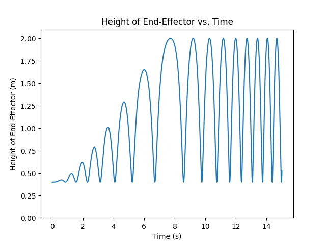
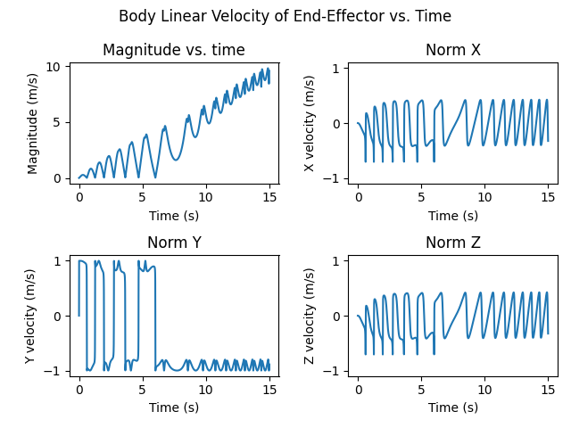
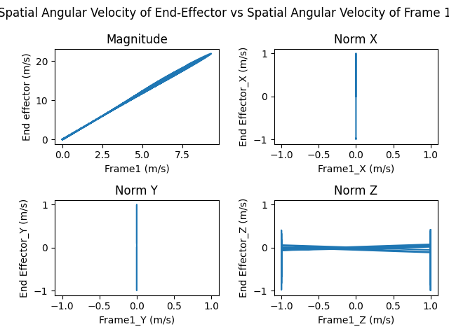
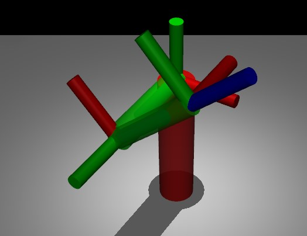

## Question 4

Question 4 is a bit different from the rest of the questions as it mostly involves coding. In question 4 the pendulum starts at the home position and is driven by an actuator at frame one which applies a torque given by: 
$$\tau = -15 \operatorname{sgn} \dot{\theta}_2$$

The code sets up the model and then steps through the simulation at a rate of 2ms per step using a RK4 integrator. The simulation loop is shown below:

```python
# Start the simulation loop
time_simulated = 0
time_to_simulate = 15#s
show_in_real_time = False
with mujoco.viewer.launch_passive(model, data) as viewer:
    steps = 0
    while viewer.is_running():
        # Set current control input
        data.ctrl[actuator_id] = -15 * np.sign(data.qvel[1].copy())

        # Step simulation
        mujoco.mj_step(model, data)

        if show_in_real_time:
            #Update viewer
            viewer.sync()
            #Sleep so you can watch the simulation in real time.
            time.sleep(0.002)
        time_simulated += .002
        steps += 1
        #Now we are ready to record data for this step.
        heights.append(data.xpos[end_effector_body_id][2])
        times.append(time_simulated)
        body_lin_vels_endeffector.append(data.sensordata[:3].copy())
        R0c = data.xmat[frame1_body_id].reshape(3,3)
        spatial_ang_vels_endeffector.append(np.array(R0c) @ np.array(data.sensordata[3:6].copy()))
        spatial_ang_vels_frame_1.append(np.array(R0c) @ np.array(data.sensordata[6:9].copy()))

        # Stop the simulation after is has simulated the desired time.
        if time_simulated > time_to_simulate:
            break

print("Done Simulating")
```

Then the code proceeds to plot the data as requested, the plots are shown below:


### Heights graph


From this graph we see that the heights gradually increased, and stayed between 0.4m and 2m. This is because the end-effector can only be in that height range due to the geometry of the pendulum. 




The second graph shows that for the first 6 seconds the magnitude of the velocity oscillates between an ever increasing value and 2. This is the result of the pendulum swinging back and forth to greater and greater heights. Then after 6 seconds it is able to complete a full rotation and the velocity no longer stops at zero. As the pendulum continues to swing it goes faster and faster which explains why the oscillations get smaller and smaller. Finally I conjecture that the linear rate of the increase of the velocity peaks is due to a sort of constant rate of energy transfer into the system. 



The last graph is also rather interesting. It graphs the end effector angular velocity versus the angular velocity of frame 1. The straight line in the magnitude graph indicates that the velocities of the two joints are proportional. This makes sense because the end-effector is has less inertia than the other links so it is reasonable for its angular velocity to be relatively faster. The vertical lines on the X and Y direction are a result of the fact that joint 1 can only rotate about the Z axis, which necessitates that its angular velocity be 0 in the X and Y directions. 


---
### Images
Here is an image of the simulation





